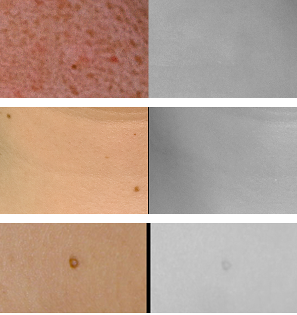
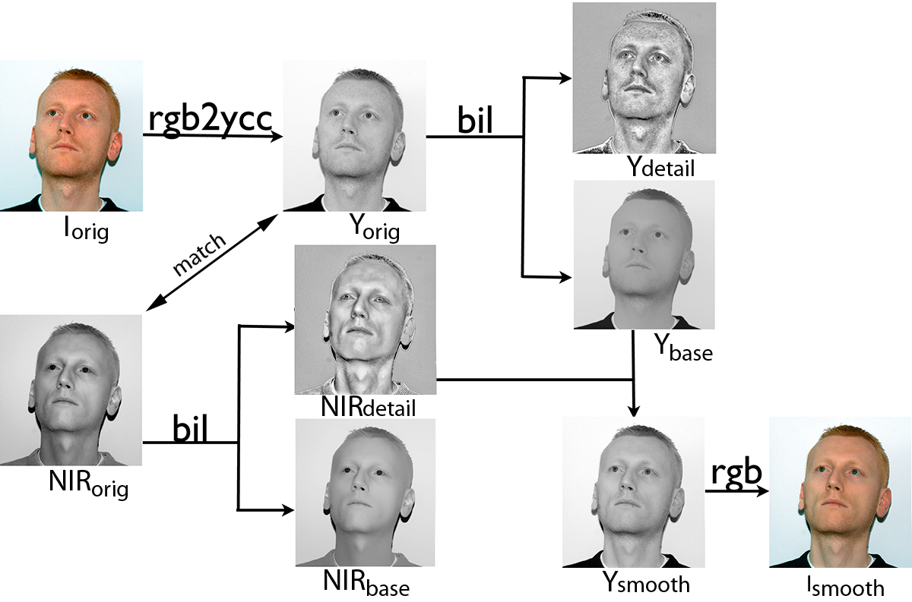
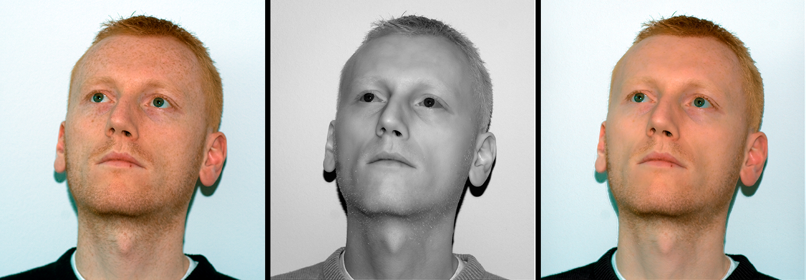

# 基于红外图像融合的美颜思路

> 原文：[**Combining visible and near-infrared images for realistic skin smoothing** - 2009](https://ivrlwww.epfl.ch/alumni/fredemba/papers/FS_CIC09.pdf)

## 介绍

如今，各大美图软件基本是大家手机里的必备APP。各家的美颜算法应该也都是在现有文献的基础上经过各种优化和调参得到的结果，在这个领域，有大名鼎鼎三大边缘保持滤波器。双边滤波，加权最小二乘滤波和导向滤波，当然还有很多别的。在美颜方面，几个滤波器的作用基本就是保持图像中明显的边缘，滤掉不明显的噪声。这个噪声在这里指的就是雀斑，皱纹，豆豆之类的，滤波也就是磨皮。至于怎么才算不明显，这都是相对而言，一般都是由参数决定。

以上所做的事，都是对现有图像的细节进行处理。本文记录的论文，利用了红外光波段的信息，对彩色图像和红外图像数据融合，达到美颜的效果，看一下RGB图像和红外图像的成像效果（图片均来源论文）。

RGB图和红外图

细节对比
可以看到，红外图像能拍到更光滑的皮肤表面，它忽略了很多“不好的细节”。至于原理，简单讲就是红外光有更长的波长，不易在皮肤表面造成散射折射，穿透力更强，因此不会被表皮上的色素阻隔，从而能更好的反映皮肤本身的信息。

## 算法

算法中用到了双边滤波器来分离图像的基本层和细节层。整个算法很简单，就是分别对已配准的彩色图和红外图滤波，然后把彩色图的基本层和红外图的基本层相加即可，流程如下。

算法流程
## 结果

分别为RGB图，NIR图，结果
## 总结

图像融合问题的典型方法，滤波进行多尺度分离，融合。

## 参考

[1]Fredembach C, Barbuscia N, Süsstrunk S. Combining visible and near-infrared images for realistic skin smoothing[C]//Color and Imaging Conference. Society for Imaging Science and Technology, 2009, 2009(1): 242-247.

